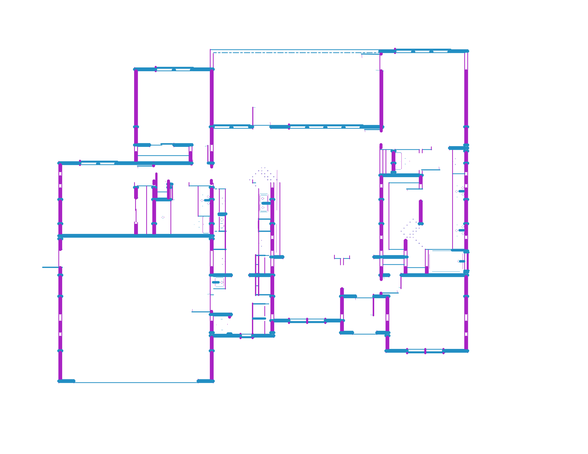
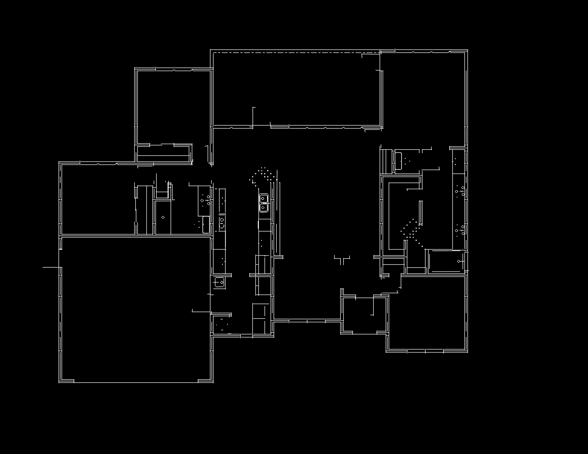
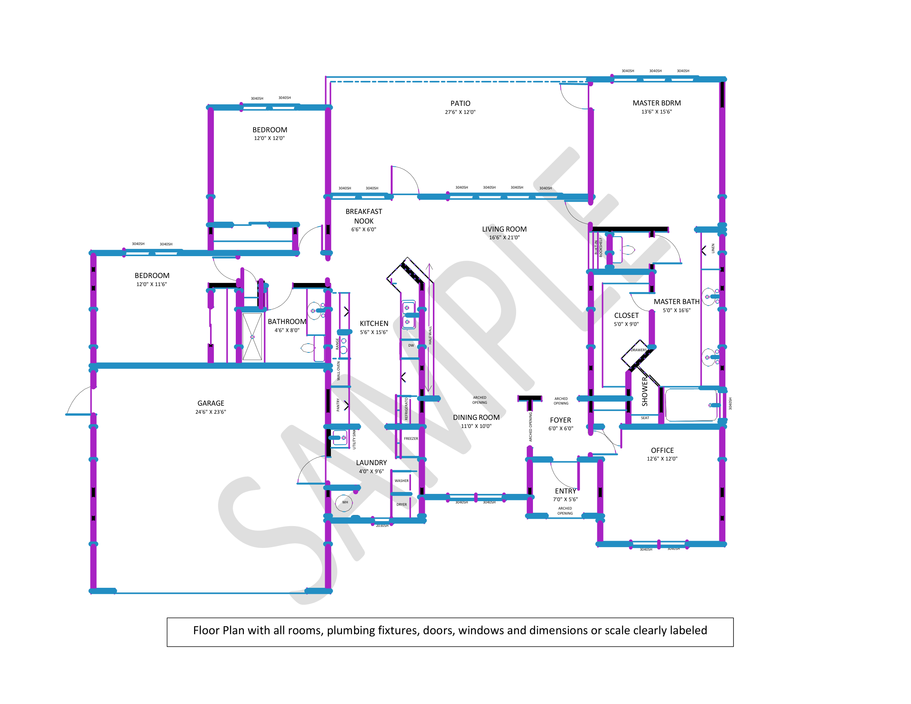
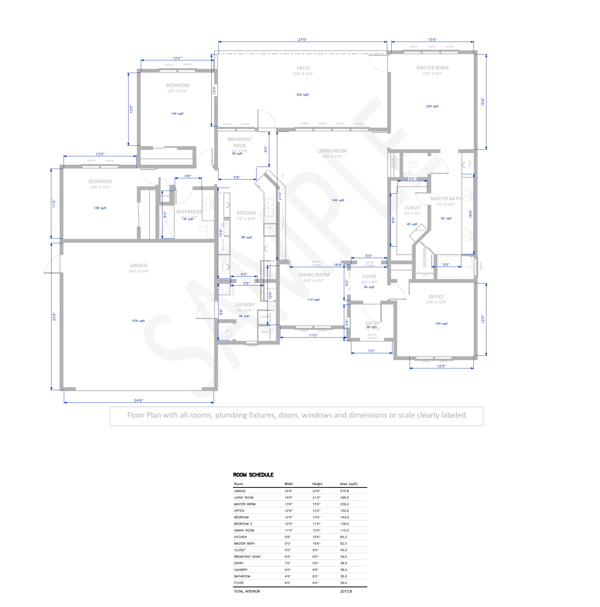
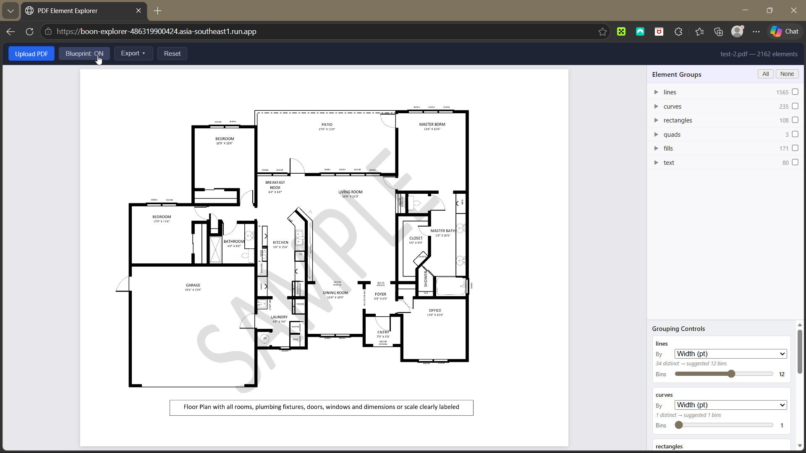
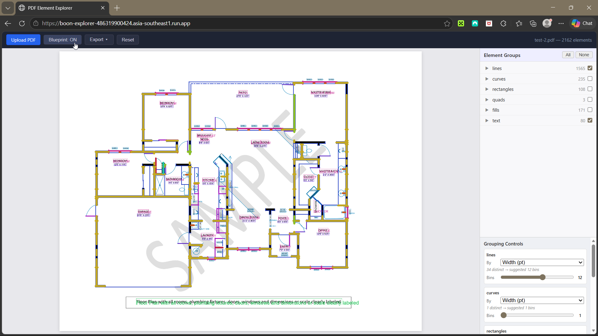
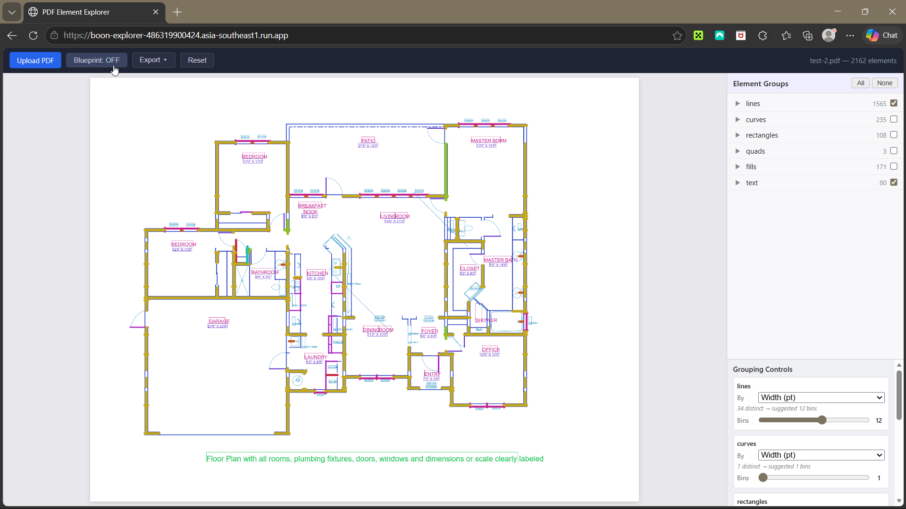

# Spatial Analysis

Automated spatial analysis pipeline for architectural floor plan PDFs. Extracts structural elements, detects room boundaries, computes room dimensions, and generates annotated outputs with ISO 128 dimension lines and room polygons.

## Live Demo

**Web App**: [boon-explorer](https://boon-explorer-486319900424.asia-southeast1.run.app) — Upload a PDF floor plan, toggle element visibility, adjust groupings, and export wall masks for the CV pipeline.

## Results

<table>
<tr>
<td width="33%">

<p align="center"><em>Extracted PDF elements — lines, fills, curves, rectangles color-coded by type.</em></p>
</td>
<td width="33%">

<p align="center"><em>Wall mask exported from web app — 81K wall pixels selected from 2,162 total elements.</em></p>
</td>
<td width="33%">

<p align="center"><em>Blueprint with selected wall elements overlaid at 3x resolution.</em></p>
</td>
</tr>
<tr>
<td colspan="3">

<p align="center"><em>Final output — ISO 128 dimension lines with adaptive wall detection calibrated at 23.33 px/ft. Per-room placement with outside and negative (inside) offsets. Room schedule with 16 rooms, 2,073.8 sqft total interior.</em></p>
</td>
</tr>
</table>

## Web App

<table>
<tr>
<td width="33%">

<p align="center"><em>Original PDF rendered at 3x with element groups sidebar, grouping controls, and zoom/pan.</em></p>
</td>
<td width="33%">

<p align="center"><em>All elements visible — color-coded by type. Toggle groups or individual elements.</em></p>
</td>
<td width="33%">

<p align="center"><em>Selected elements exported as PNG with original PDF colors for the CV pipeline.</em></p>
</td>
</tr>
</table>

## Pipeline Overview

```
PDF Floor Plan
     │
     ▼
┌─────────────────────┐
│  Element Extraction  │  extract_floorplan.py
│  (PyMuPDF)          │  Lines, fills, curves, text, images, tables
└─────────┬───────────┘
          │
          ▼
┌─────────────────────┐
│  Interactive Web App │  webapp/
│  (FastAPI + Canvas)  │  Toggle elements, zoom, pan, export
└─────────┬───────────┘
          │
     ┌────┴────┐
     ▼         ▼
┌──────────┐ ┌──────────────┐
│ Annotate │ │  Watershed   │
│ Walls    │ │  Rooms       │
│          │ │              │
│ Dim lines│ │ Segmentation │
│ Polygons │ │ Area compute │
└──────────┘ └──────────────┘
```

### 1. Element Extraction (`src/extract_floorplan.py`)

Parses PDF pages using PyMuPDF and classifies every drawing element:
- **Lines** (1,565) — walls, fixtures, annotations
- **Fills** (171) — solid regions, dimension breaks, arrowheads
- **Curves** (235) — arcs, door swings
- **Rectangles** (10) — stroked rectangles (fill-only rects filtered)
- **Text** (80) — room labels, dimensions, fixture names
- **Images** — embedded raster images with per-image CTM decomposition
- **Tables** — detected table regions with row/column counts

Handles rotated PDFs by normalizing page rotation to 0° before extraction.

```bash
python src/extract_floorplan.py inputs/test-2.pdf
```

### 2. Interactive Web App (`webapp/`)

Single-page app for visual element exploration and export:

- Upload any PDF floor plan (handles rotated pages automatically)
- Toggle visibility per element group or individual element
- Dynamic grouping by property (width, color, area, font size) with configurable bin count
- Rasterized PDF background at 3x resolution
- Zoom (+/−/Fit) and click-drag pan navigation
- Embedded image rendering with per-image CTM rotation and flip
- **Export JSON** — selected elements with both pt and px coordinates
- **Export PNG (Selected Elements)** — faithful reconstruction using original PDF colors
- **Export PNG (Blueprint)** — rasterized PDF background with selected element overlay

```bash
uvicorn webapp.server:app --port 8000
# or
docker build -t spatial-analysis . && docker run -p 8000:8000 spatial-analysis
```

### 3. Wall Annotation (`src/annotate_walls.py`)

Generates dimension-line annotated floor plans following ISO 128 / ANSI Y14.5:

- **Adaptive wall detection** — band scanning (5-80px) with expected-distance validation finds wall boundaries from exported mask
- **Multi-room calibration** — pixels-per-foot derived from enclosed rooms (BEDROOM, BEDROOM 2, OFFICE) with robust median and outlier rejection
- **Per-room placement** — explicit placement table controls dimension line position (outside, inside/negative offset) per room
- **Room schedule** — summary table with stated dimensions and computed areas

```bash
python src/annotate_walls.py inputs/test-2_mask_20260402_205333.png
```

Outputs: annotated PNG, 2-page PDF (floor plan + schedule), JSON with wall boundaries and scan validation flags.

### 4. Watershed Room Segmentation (`src/watershed_rooms.py`)

Segments the floor plan into rooms using gradient-based watershed:

- Blueprint gradient (Sobel) as watershed landscape — 12x more edge information than wall mask alone
- Wall pixels boosted to maximum in the landscape
- Dense perimeter background seeds (every 50px) prevent exterior absorption
- GARAGE-calibrated area computation with per-room accuracy assessment

```bash
python src/watershed_rooms.py inputs/test-2_mask_20260402_181715.png
```

## Tech Stack

- **PDF Parsing**: PyMuPDF (fitz)
- **Computer Vision**: OpenCV, scikit-image (watershed)
- **Geometry**: Shapely (room polygons, GeoJSON)
- **Web App**: FastAPI + vanilla JS Canvas
- **Deployment**: Docker, Google Cloud Run

## Project Structure

```
├── src/
│   ├── extract_floorplan.py    # PDF element extraction
│   ├── annotate_walls.py       # Wall annotation with dimension lines
│   ├── watershed_rooms.py      # Room segmentation
│   └── generate_report.py      # Visual report utility
├── webapp/
│   ├── server.py               # FastAPI backend
│   ├── extraction.py           # PDF processing endpoint
│   └── static/                 # Single-page app (JS + Canvas)
├── inputs/                     # Sample floor plan PDFs and exports
├── outputs/                    # Generated annotations and polygons
├── Dockerfile
└── requirements.txt
```

## Quick Start

```bash
# Setup
python -m venv .venv && source .venv/bin/activate
pip install -r requirements.txt

# Run web app
uvicorn webapp.server:app --port 8000

# Run annotation pipeline
python src/annotate_walls.py inputs/test-2_mask_20260402_205333.png

# Run room segmentation
python src/watershed_rooms.py inputs/test-2_mask_20260402_181715.png
```
