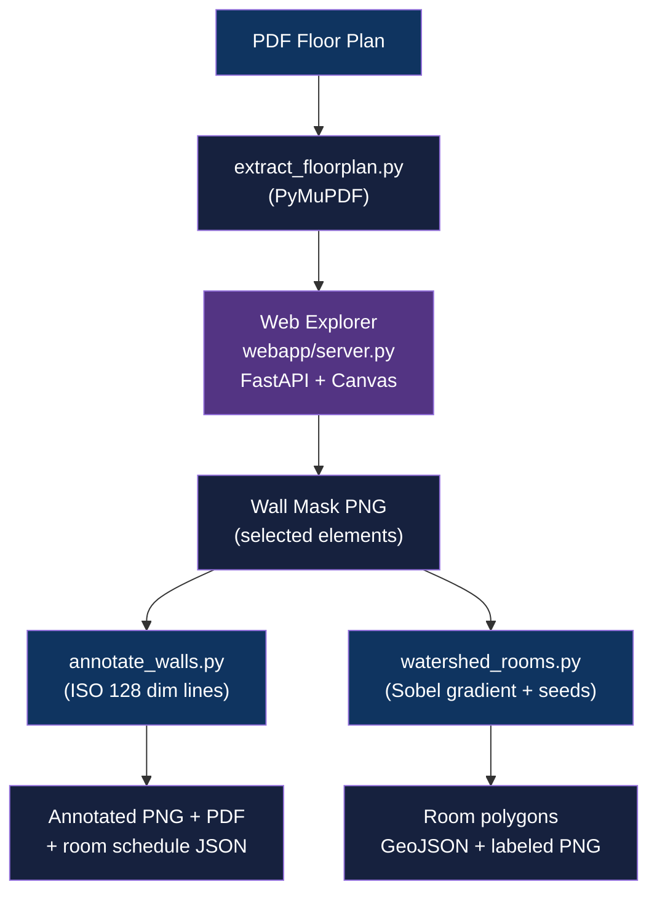
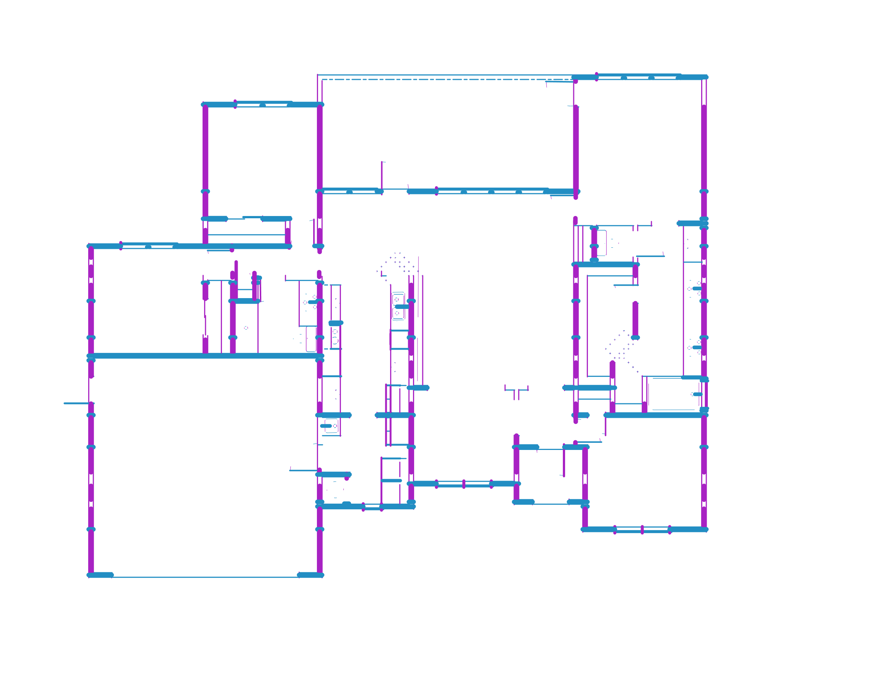
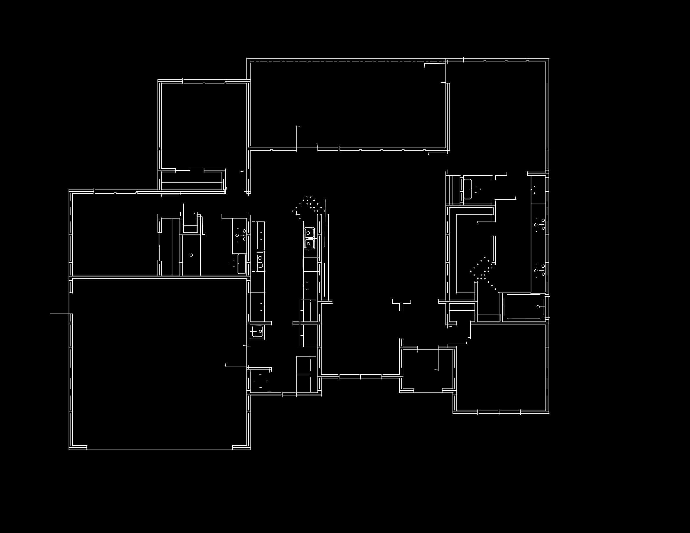
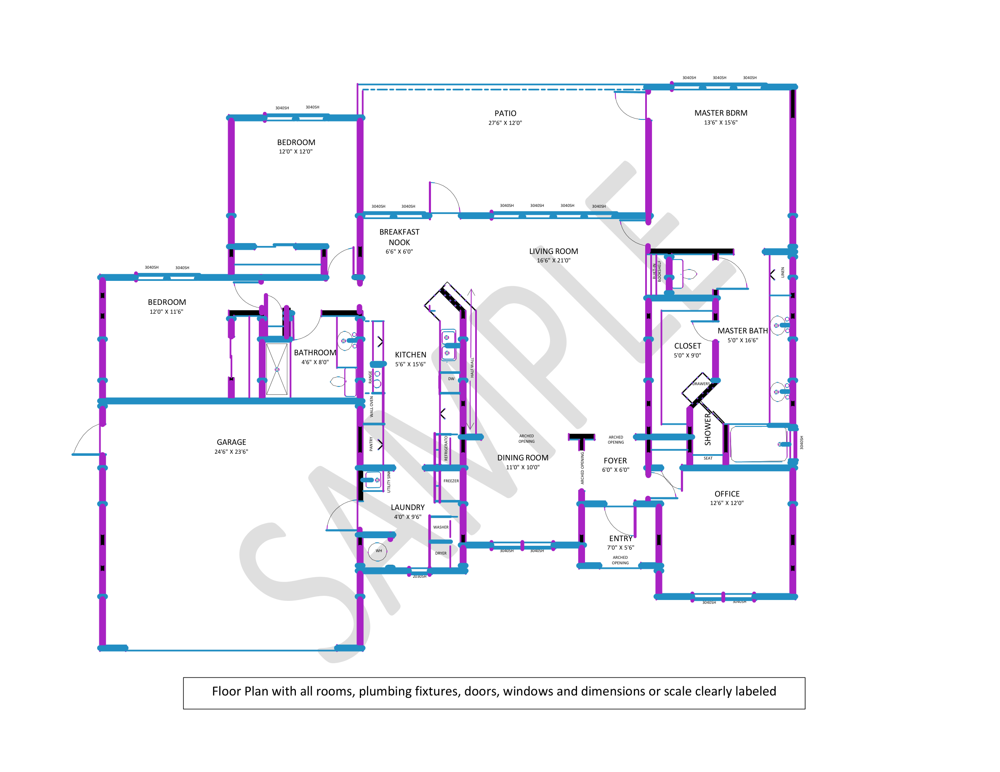
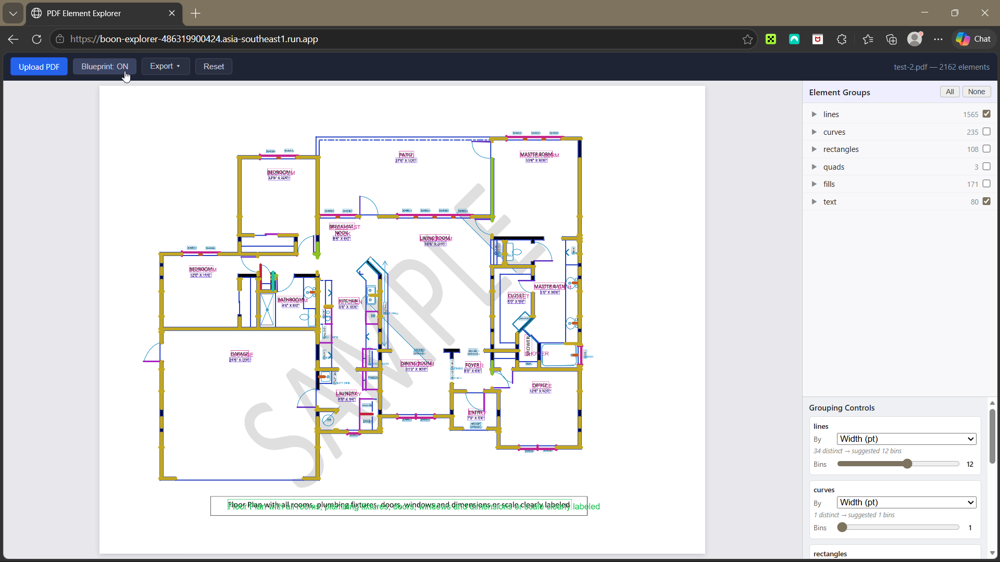
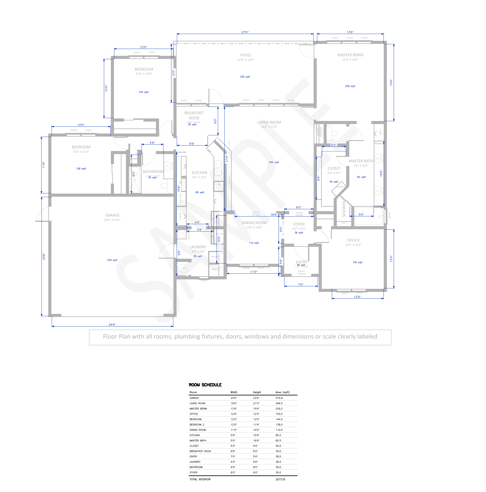
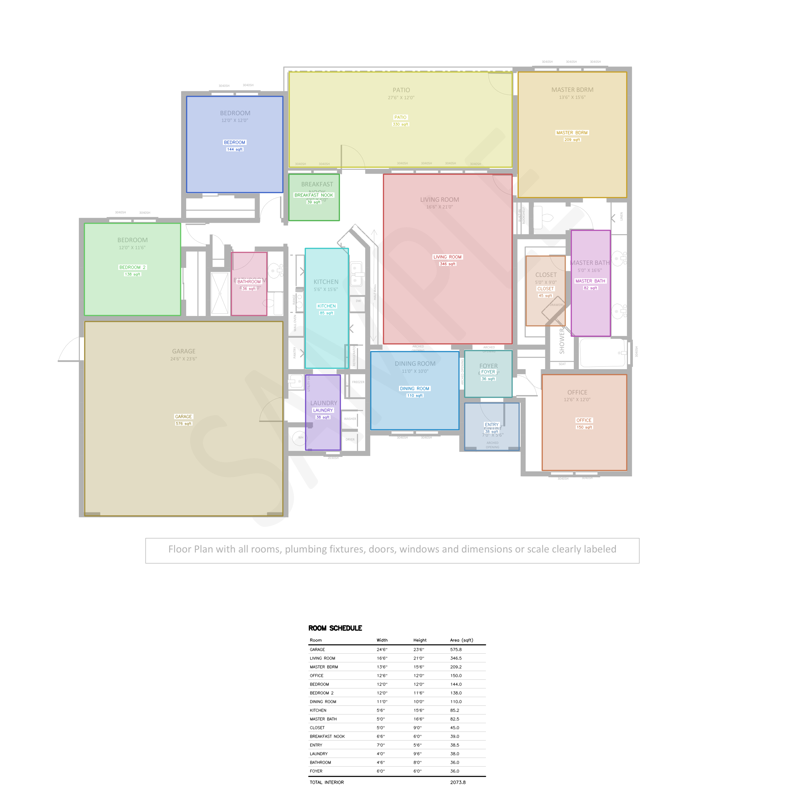

<div align="center">

# Spatial Analysis

[](https://www.python.org/downloads/)
[](https://fastapi.tiangolo.com/)
[](LICENSE)

**Automated spatial analysis for floor-plan PDFs: element extraction, wall annotation, room segmentation, web explorer**

[Getting Started](#getting-started) | [Usage](#usage) | [Architecture](#architecture)

</div>

---

## Table of Contents

- [The Problem](#the-problem)
- [Features](#features)
- [Tech Stack](#tech-stack)
- [Architecture](#architecture)
- [Demo](#demo)
- [Getting Started](#getting-started)
  - [Prerequisites](#prerequisites)
  - [Installation](#installation)
- [Usage](#usage)
- [How It Works](#how-it-works)
- [Results](#results)
- [Architectural Decisions](#architectural-decisions)
- [Project Structure](#project-structure)
- [Deployment](#deployment)
- [Related Projects](#related-projects)
- [License](#license)
- [Author](#author)

## The Problem

### Reading Floor Plans at Scale

Architectural floor plan PDFs are vector documents with no semantic layer: walls, fixtures, text, and dimension lines are all raw drawing primitives with no labels. Measuring room areas, extracting wall boundaries, or feeding a CV pipeline requires either expensive manual tracing or brittle rasterization that discards vector fidelity.

### The Solution

This pipeline decomposes floor-plan PDFs into typed element groups using PyMuPDF's vector access, lets a human or downstream system select the wall layer via an interactive web explorer, then applies ISO 128 dimension-line annotation and gradient-based watershed room segmentation on the selected mask.

## Features

- **PDF element extraction** - classifies every drawing primitive (lines, fills, curves, rectangles, text, images, tables) with type-specific metadata
- **Interactive web explorer** - upload any PDF, toggle element groups by property (width, color, area), zoom/pan, and export selected elements as JSON or PNG mask
- **ISO 128 wall annotation** - adaptive band scanning (5-80px) derives pixel-per-foot calibration from enclosed rooms, then places dimension lines with per-room outside and inside offsets
- **Watershed room segmentation** - Sobel-gradient landscape with wall-pixel boosting and dense perimeter seeds segments floor plans into labeled rooms with computed areas
- **Multi-format output** - annotated PNG, 2-page PDF (floor plan + room schedule), GeoJSON room polygons, and JSON wall boundaries with scan validation flags
- **Rotation-aware parsing** - normalizes page rotation to 0 degrees before extraction; handles rotated embedded images via per-image CTM decomposition

## Tech Stack

| Component | Technology |
|-----------|------------|
| Language | Python 3.11+ |
| PDF Parsing | PyMuPDF (fitz) |
| Computer Vision | OpenCV, scikit-image (watershed) |
| Geometry | Shapely (room polygons, GeoJSON) |
| Web App | FastAPI + vanilla JS Canvas |
| Deployment | Docker, Google Cloud Run |

## Architecture


```mermaid
graph TD
    A["PDF Floor Plan"] --> B["extract_floorplan.py\n(PyMuPDF)"]
    B --> C["Web Explorer\nwebapp/server.py\nFastAPI + Canvas"]
    C --> D["Wall Mask PNG\n(selected elements)"]
    D --> E["annotate_walls.py\n(ISO 128 dim lines)"]
    D --> F["watershed_rooms.py\n(Sobel gradient + seeds)"]
    E --> G["Annotated PNG + PDF\n+ room schedule JSON"]
    F --> H["Room polygons\nGeoJSON + labeled PNG"]

    style A fill:#0f3460,color:#fff
    style B fill:#16213e,color:#fff
    style C fill:#533483,color:#fff
    style D fill:#16213e,color:#fff
    style E fill:#0f3460,color:#fff
    style F fill:#0f3460,color:#fff
    style G fill:#16213e,color:#fff
    style H fill:#16213e,color:#fff
```

## Demo

<table>
<tr>
<td width="33%">

<p align="center"><em>Extracted PDF elements - lines, fills, curves, rectangles color-coded by type.</em></p>
</td>
<td width="33%">

<p align="center"><em>Wall mask exported from web app - 81K wall pixels selected from 2,162 total elements.</em></p>
</td>
<td width="33%">

<p align="center"><em>Blueprint with selected wall elements overlaid at 3x resolution.</em></p>
</td>
</tr>
</table>


<p align="center"><em>Upload any PDF floor plan - toggle element groups, adjust grouping by property, zoom and pan, export selected elements as JSON or PNG.</em></p>

## Getting Started

### Prerequisites

- Python 3.11+
- `libgl1` and `libglib2.0-0` system libraries (for OpenCV headless; installed automatically in Docker)

### Installation

1. Clone the repository:
   ```bash
   git clone https://github.com/adityonugrohoid/spatial-analysis.git
   cd spatial-analysis
   ```

2. Create and activate a virtual environment:
   ```bash
   python -m venv .venv
   source .venv/bin/activate
   ```

3. Install dependencies:
   ```bash
   pip install -r requirements.txt
   ```

## Usage

**Run the web explorer:**

```bash
uvicorn webapp.server:app --port 8000
```

Open `http://localhost:8000`, upload a PDF floor plan, select the wall element group, and export the mask as PNG.

**Run the annotation pipeline on an exported wall mask:**

```bash
python src/annotate_walls.py inputs/test-2_mask_20260402_205333.png
```

**Run room segmentation:**

```bash
python src/watershed_rooms.py inputs/test-2_mask_20260402_181715.png
```

**Extract raw elements from a PDF:**

```bash
python src/extract_floorplan.py inputs/test-2.pdf
```

## How It Works

### 1. Element Extraction (`src/extract_floorplan.py`)

PyMuPDF parses each PDF page and classifies every drawing primitive into typed groups: lines (1,565), fills (171), curves (235), rectangles (10), text (80), embedded images, and table regions. Each element carries both PDF-point and rasterized-pixel coordinates. The page rotation is normalized to 0 degrees before extraction to ensure consistent coordinate frames.

### 2. Interactive Web Explorer (`webapp/`)

The FastAPI backend exposes a single endpoint (`POST /api/extract`) that accepts a PDF upload and returns grouped elements with a base64-encoded rasterized background at 3x resolution. The vanilla JS frontend renders elements on an HTML Canvas with per-group toggle controls, dynamic re-grouping by any numeric property (width, color channel, area, font size), and zoom/pan navigation. Export modes: JSON (selected elements with pt and px coordinates), PNG (faithful vector reconstruction), PNG (rasterized background + overlay).

### 3. Wall Annotation (`src/annotate_walls.py`)

Reads the exported wall mask PNG. A band scanner (+-60px) walks each room boundary to locate wall edges, validated against expected distances with 20% tolerance. Pixel-per-foot calibration uses a median across multiple enclosed rooms (BEDROOM, BEDROOM 2, OFFICE) with outlier rejection. Dimension lines follow ISO 128 / ANSI Y14.5 style: arrowheads at 10px length, extension lines with 3px gap and 5px overshoot. A per-room placement table controls line position (outside vs. negative/inside offset). Output: annotated PNG, 2-page PDF with room schedule, JSON with wall boundaries and scan validation flags.

### 4. Watershed Room Segmentation (`src/watershed_rooms.py`)

Builds the watershed landscape from a Sobel-gradient of the rasterized blueprint, boosting wall pixels to maximum gradient to force watershed boundaries at walls. Dense perimeter background seeds (every 50px on all four edges) prevent exterior absorption. Room seeds come from the text element centroids exported at extraction time. Area calibration uses a reference room (GARAGE) to derive sqft-per-pixel, applied to all detected segments.

## Results

<table>
<tr>
<td colspan="3">

<p align="center"><em>ISO 128 dimension lines with adaptive wall detection calibrated at 23.33 px/ft. Per-room placement with outside and inside offsets. Room schedule: 16 rooms, 2,073.8 sqft total interior.</em></p>
</td>
</tr>
<tr>
<td width="50%">

<p align="center"><em>Watershed room segmentation with labeled polygons and computed areas.</em></p>
</td>
<td width="50%">

<p align="center"><em>Room schedule summary in 2-page PDF output.</em></p>
</td>
</tr>
</table>

## Architectural Decisions

### 1. Vector extraction before rasterization

**Decision:** Use PyMuPDF's path and text API to extract typed elements before the web app rasterizes the background.

**Reasoning:** Raster-only approaches lose element boundaries and stroke properties needed for calibration. Keeping both the vector extraction and the 3x rasterized background in the same response lets the canvas overlay vector elements precisely on the background without coordinate drift.

### 2. Web-assisted wall selection over automatic segmentation

**Decision:** Route wall mask creation through an interactive web app rather than running fully automated wall detection.

**Reasoning:** Floor plan PDFs vary widely in element organization. Manual toggle-and-export takes under two minutes and produces a clean, human-verified mask. Fully automatic detection would require per-dataset tuning and still fail on unusual element groupings. The exported mask then feeds deterministic downstream stages.

### 3. Blueprint gradient as watershed landscape

**Decision:** Use the Sobel gradient of the rasterized blueprint (not just the wall mask) as the watershed landscape.

**Reasoning:** The blueprint gradient carries 12x more edge information than the binary wall mask alone. Using it as the landscape allows watershed to find room boundaries along structural edges even where the wall mask has gaps, reducing over-segmentation without custom gap-filling heuristics.

## Project Structure

```
spatial-analysis/
├── src/
│   ├── extract_floorplan.py    # PDF element extraction (PyMuPDF)
│   ├── annotate_walls.py       # ISO 128 dimension-line annotation
│   ├── watershed_rooms.py      # Gradient-based room segmentation
│   └── generate_report.py      # Visual report utility
├── webapp/
│   ├── server.py               # FastAPI backend (POST /api/extract)
│   ├── extraction.py           # PDF processing logic
│   └── static/                 # Single-page app (JS + Canvas)
├── inputs/                     # Sample floor plan PDFs and exported masks
├── outputs/                    # Generated annotations and room polygons
├── docs/                       # Web app screenshots
├── Dockerfile
└── requirements.txt
```

## Deployment

### Local (uvicorn)

```bash
uvicorn webapp.server:app --host 0.0.0.0 --port 8000
```

### Docker

```bash
docker build -t spatial-analysis .
docker run -p 8000:8000 spatial-analysis
```

### Cloud Run (historical)

The web explorer was originally deployed to Google Cloud Run (asia-southeast1) during the Google GenAI Academy APAC 2026 Hackathon at `https://boon-explorer-486319900424.asia-southeast1.run.app`. The hackathon project's billing has since been closed and the URL is no longer live. The durable artifact is this repo and the output images in `inputs/` and `outputs/`.

## Related Projects

| Project | Description |
|---------|-------------|
| [cv-pipeline](https://github.com/adityonugrohoid/cv-pipeline) | Progressive computer vision pipeline for construction blueprints: shape detection, OCR, YOLOv8n symbol detection, and multi-stage analyzer with FastAPI server |

## License

This project is licensed under the [MIT License](LICENSE).

## Author

**Adityo Nugroho** ([@adityonugrohoid](https://github.com/adityonugrohoid))
